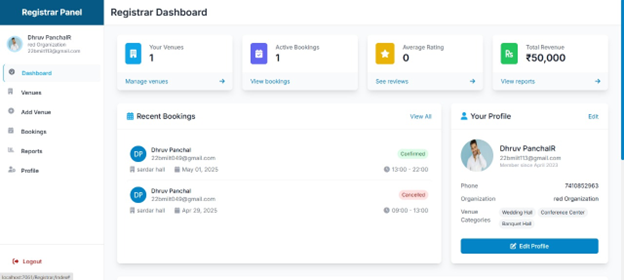

# **Event Management System**

_A comprehensive platform for organizing, managing, and coordinating events efficiently._

---

## 📜 **Overview**  
The **Event Management System** is a web application developed to streamline event planning and management. Built using **ASP.NET Core** and **SQL Server**, this system helps event organizers, registrars, and customers to easily manage events, bookings, payments, and reviews.

The project supports three types of users with role-specific functionalities:

- **Admin**: Manages events, equipment, venues, and user activities.  
- **Customer**: Registers, books events, makes payments, and submits reviews.  
- **Registrar**: Manages venue bookings and event schedules.

---

## ✨ **Key Features**

### **Admin Panel**  
- Manage events (add, update, delete).  
- Handle venue management (add, update, delete).  
- Oversee booking, payment, and review processes.  
- Manage equipment, flowers, food, lighting, and other event-specific items.

### **Customer Dashboard**  
- Register and log in securely.  
- Browse events and make bookings.  
- View and manage payment details.  
- Submit reviews for events attended.  
- Receive notifications for event updates.

### **Registrar Dashboard**  
- Add, update, and delete venues.  
- Manage event bookings and availability.  
- View event schedules and booking details.

---

## 🖥️ **Screenshots**

### **Home Page**  


### **Admin Dashboard**  


### **Customer Dashboard**  


### **Registrar Dashboard**  


---

## 🛠️ **Technologies Used**  
- **Frontend**: HTML, Tailwind CSS, Bootstrap  
- **Backend**: ASP.NET Core  
- **Database**: SQL Server  
- **Development Tools**: Visual Studio 2022  

---

## 🚀 **How to Install and Run**

### **Step 1: Clone the Repository**  
```bash
git clone https://github.com/your-username/event-management-system.git
```
### **Step 2: Configure the Environment**
- **Open the project in Visual Studio 2022.**

- **Update the connection string in appsettings.json to point to your local or remote SQL Server instance.**

- **Run the database migrations to create the necessary tables.**

```bash

Update-Database
```
### **Step 3: Run the Application**
- **Press F5 to build and run the application in Visual Studio.**

- **Open your web browser and navigate to http://localhost:5000 (or the port configured in your project).**

### **🧑‍💻 Contributors**
- **Nilesh Parmar - Developer**

### **🌟 Future Enhancements**
- **Real-time event status updates for customers.**

- **Enhanced reporting and analytics for admin users.**

- **Integration with external payment gateways (PayPal, Stripe).**

- **Support for mobile applications for event registration and booking.**

- **Multi-language support for global event management.**

### **📷 Image Credits**
(Screenshots and visuals were designed and captured for demonstration purposes.)

- **Nilesh Parmar - Developer**

### **🙌 Thank You for Checking Out This Project!**
- **Feel free to contribute by forking the repository, making improvements, and submitting pull requests.**
- **If you like this project, don't forget to ⭐ star the repository!**


